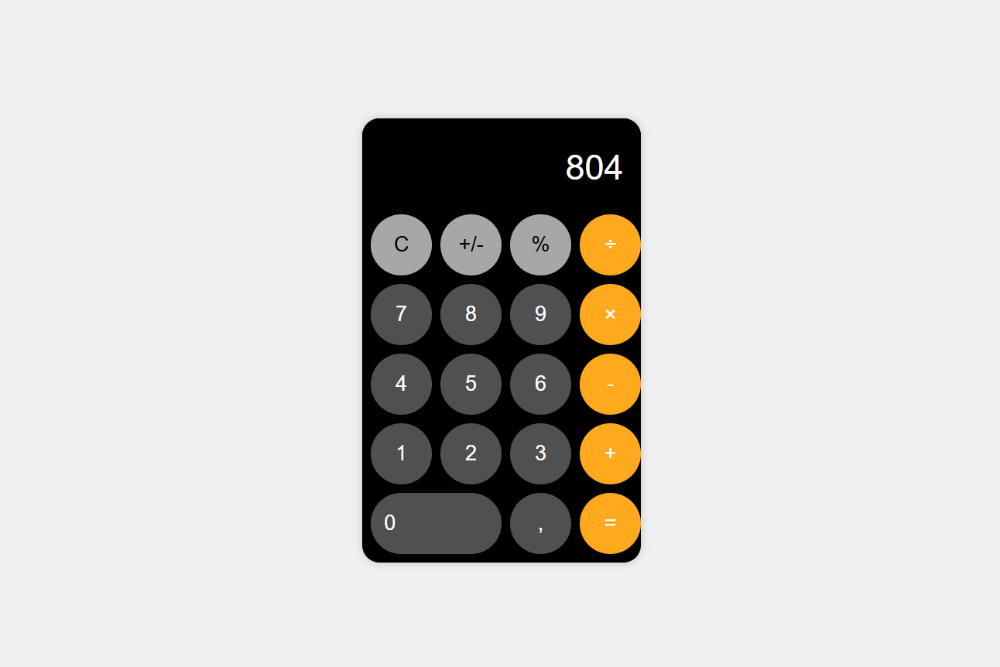
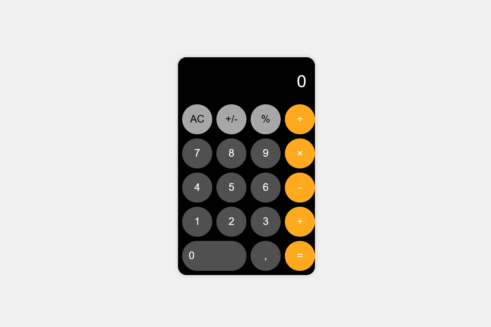

# Apple Calculator 🧮

A simple web-based clone of the **Apple iOS Calculator**, built using **HTML, CSS, and JavaScript**.  
This project mimics the clean design and basic functionality of the original Apple calculator app.

---

## 📸 Screenshots

### Calculator Interface


### Example Calculation


---

## 🚀 Features
- Basic arithmetic operations: addition, subtraction, multiplication, division  
- Percentage calculation  
- Sign toggle (+/-)  
- Clear (AC) button  
- Responsive design inspired by Apple's calculator  

---

## 📂 Project Structure
```
Apple-Calculator/
│── index.html      # Main HTML file
│── style.css       # Stylesheet for UI
│── app.js          # Calculator logic
│── assets/         # Screenshots or other assets
│── README.md       # Project documentation
```

---

## 🛠️ Installation & Setup

### Option 1: Open Directly
1. Download or clone this repository.
2. Open `index.html` in your browser by double-clicking.

### Option 2: Run in VS Code (Recommended)
1. Open the project folder in **Visual Studio Code**.  
2. Install the extension **Live Server** (by Ritwick Dey).  
3. Right-click on `index.html` → **Open with Live Server**.  
4. The calculator will open in your browser at `http://127.0.0.1:5500/`.

### Option 3: Run with Local Server
If you have **Python** installed:  
```bash
cd Apple-Calculator
python -m http.server
```
Then open [http://localhost:8000](http://localhost:8000) in your browser.  

---

## 🎮 Usage
- Click the calculator buttons to perform calculations.  
- Supports basic arithmetic and percentage functions.  
- Works in any modern browser.  

---

## 💡 Future Improvements
- Add scientific functions (sin, cos, log, etc.)  
- Keyboard shortcuts support  
- Dark mode toggle  

---

## 📜 License
This project is open source and available under the **MIT License**.

---

Made with ❤️ by Me